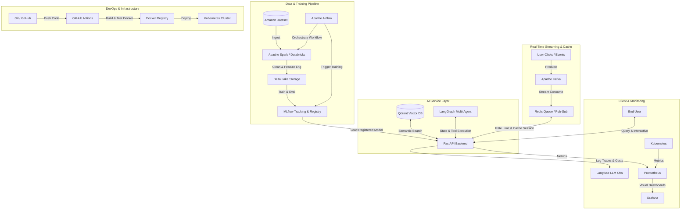

# AI Engineer Roadmap – Modern AI Production Pipeline
## Dự Án Thực Hành: **SmartShop AI Platform**
### *Hệ Thống Gợi Ý Sản Phẩm Thời Gian Thực & Multi-Agent Hỗ Trợ Khách Hàng Thông Minh*

Chào mừng bạn đến với tài liệu hướng dẫn chi tiết dự án **SmartShop AI Platform**. Đây là một dự án mẫu được thiết kế nhằm mục đích học tập, giúp bạn tiếp cận và làm chủ toàn bộ **15 công nghệ cốt lõi** của một **AI Production Pipeline** hiện đại.

Dữ liệu đầu vào sẽ sử dụng **Amazon Product Metadata and Reviews dataset** (phiên bản rút gọn hoặc dữ liệu giả lập có cấu trúc tương đương), là nguồn dữ liệu mở, dễ dàng tải về và chứa đầy đủ cả thông tin cấu trúc (giá, danh mục) lẫn phi cấu trúc (văn bản review, mô tả sản phẩm).

---

## 📐 Kiến Trúc Tổng Thể Hệ Thống (System Architecture)

Dưới đây là luồng xử lý dữ liệu và vận hành của hệ thống từ lúc thu thập, xử lý, huấn luyện cho đến khi phục vụ người dùng cuối:



---

## 🛠️ Lộ Trình Triển Khai 10 Phases Chi Tiết

---

### Phase 1: Source Control & Foundation CI/CD
**Mục tiêu**: Thiết lập môi trường cộng tác chuẩn dự án công nghiệp, tự động hóa quy trình kiểm thử và đóng gói.

*   **Công nghệ sử dụng**: Git, GitHub, GitHub Actions.
*   **Các bước thực hiện**:
    1. Khởi tạo Git repository cục bộ và liên kết với GitHub.
    2. Định nghĩa cấu trúc thư mục dự án chuẩn chỉnh.
    3. Cấu hình GitHub Actions pipeline để chạy Linter (flake8/black) và Unit Test (pytest) tự động mỗi khi có code mới push lên nhánh `main`.

#### Code Minh Họa: Cấu hình GitHub Actions Workflow (`.github/workflows/ci-cd.yml`)
```yaml
name: SmartShop CI/CD Pipeline

on:
  push:
    branches: [ main ]
  pull_request:
    branches: [ main ]

jobs:
  build-and-test:
    runs-on: ubuntu-latest
    steps:
    - name: Checkout code
      uses: actions/checkout@v3

    - name: Set up Python 3.10
      uses: actions/setup-python@v4
      with:
        python-version: "3.10"

    - name: Install dependencies
      run: |
        python -m pip install --upgrade pip
        pip install black pytest flake8
        if [ -f requirements.txt ]; then pip install -r requirements.txt; fi

    - name: Lint with flake8
      run: |
        # stop the build if there are Python syntax errors or undefined names
        flake8 . --count --select=E9,F63,F7,F82 --show-source --statistics
        # exit-zero treats all errors as warnings.
        flake8 . --count --exit-zero --max-complexity=10 --max-line-length=127 --statistics

    - name: Run unit tests
      run: |
        pytest tests/
```

---

### Phase 2: Big Data Ingestion & ETL Pipeline
**Mục tiêu**: Xây dựng pipeline ingest dữ liệu sản phẩm/review có thể chạy được cả local Spark và Databricks, chuẩn hóa dữ liệu thô thành bảng sản phẩm sạch để phục vụ huấn luyện model, semantic search và API ở các phase sau.

*   **Công nghệ sử dụng**: Apache Spark (Databricks) & Apache Airflow.
*   **Các bước thực hiện**:
    1. Viết Spark ETL job nhận tham số input/output qua CLI hoặc biến môi trường, hỗ trợ JSON/JSONL/CSV/Parquet để dễ chạy local và chuyển sang Databricks.
    2. Chuẩn hóa schema sản phẩm: `product_id`, `title`, `description`, `brand`, `category`, `price`, `price_tier`, đồng thời lọc bản ghi thiếu khóa chính hoặc dữ liệu không hợp lệ.
    3. Nếu có dữ liệu review, aggregate `avg_rating` và `review_count` theo sản phẩm để chuẩn bị feature cho Phase 3.
    4. Ghi output dạng Delta Table khi chạy trên Databricks/local có Delta; có thể đổi sang Parquet cho môi trường dev nhẹ hơn.
    5. Tạo Apache Airflow DAG lập lịch Daily ETL, truyền tham số vào Databricks job qua biến môi trường thay vì hard-code cluster/path trong code.

#### Code Minh Họa: Spark ETL Job (`jobs/spark_etl.py`)
```python
from jobs.spark_etl import parse_args, run_etl

if __name__ == "__main__":
    run_etl(parse_args())
```

#### Code Minh Họa: Airflow DAG (`dags/etl_scheduler.py`)
```python
from dags.etl_scheduler import dag
```

> Triển khai thật nằm trong `jobs/spark_etl.py` và `dags/etl_scheduler.py`; roadmap chỉ giữ snippet ngắn để tránh tài liệu bị lệch khỏi code khi pipeline phát triển.

#### Ghi Chú Chạy Phase 2 Bằng Ubuntu WSL Trên Windows

Spark local trên Windows có thể gặp lỗi `HADOOP_HOME` / `winutils.exe`. Cách đơn giản hơn là chạy Phase 2 trong Ubuntu WSL:

```powershell
wsl -d Ubuntu
```

Trong Ubuntu, đi tới project trên ổ `D:`:

```bash
cd /mnt/d/ANNGUYEN/Project/AI_Application
```

Cài Java và tạo virtual environment. Không nên tạo `.venv` trực tiếp trong `/mnt/d` vì filesystem Windows có thể lỗi symlink `lib -> lib64`; hãy tạo venv trong filesystem Linux:

```bash
sudo apt update
sudo apt install -y openjdk-17-jdk python3-venv
mkdir -p /root/.venvs
python3 -m venv /root/.venvs/ai_application
. /root/.venvs/ai_application/bin/activate
python -m pip install --upgrade pip
python -m pip install pytest black flake8 pyspark
```

Nếu shell là `bash`, có thể dùng `source /root/.venvs/ai_application/bin/activate`; nếu shell là `sh`, dùng dấu chấm `.` như lệnh ở trên.

Chạy test và ETL local:

```bash
python -m pytest tests/test_spark_etl_config.py
rm -rf data/processed/products_processed
python -m jobs.spark_etl \
  --input-products data/raw/amazon_products.jsonl \
  --input-reviews data/raw/amazon_reviews.jsonl \
  --output-path data/processed/products_processed \
  --output-format parquet \
  --master "local[*]"
ls -la data/processed/products_processed
```

---

### Phase 3: Experiment Tracking & Model Registry
**Mục tiêu**: Xây dựng mô hình phân tích cảm xúc đánh giá sản phẩm (Sentiment Analysis) hoặc dự đoán xếp hạng (Rating Prediction) và quản lý vòng đời mô hình.

*   **Công nghệ sử dụng**: MLflow (được tích hợp sẵn trong Databricks).
*   **Các bước thực hiện**:
    1. Huấn luyện mô hình phân loại Sentiment dựa trên dữ liệu đánh giá sản phẩm sử dụng Scikit-learn hoặc Hugging Face Transformers.
    2. Sử dụng MLflow để log các thông số (hyperparameters), độ đo đánh giá (Accuracy, F1-Score) và lưu trữ file model artifact.
    3. Đăng ký (Register) mô hình tốt nhất vào MLflow Model Registry để quản lý phiên bản (Staging vs. Production).

#### Code Minh Họa: Train & Track Model với MLflow (`src/train.py`)
```python
import mlflow
import mlflow.sklearn
from sklearn.model_selection import train_test_split
from sklearn.feature_extraction.text import TfidfVectorizer
from sklearn.linear_model import LogisticRegression
from sklearn.metrics import accuracy_score, f1_score
import pandas as pd

def train_sentiment_model():
    # Giả lập dữ liệu reviews đọc từ Delta Lake
    data = {
        "review_text": ["Great product, highly recommend!", "Terrible quality, broke instantly.", "Okay for the price.", "Loved it!"],
        "sentiment": [1, 0, 0, 1]
    }
    df = pd.DataFrame(data)

    X_train, X_test, y_train, y_test = train_test_split(df["review_text"], df["sentiment"], test_size=0.2, random_state=42)

    # Cấu hình MLflow Experiment
    mlflow.set_experiment("/SmartShop_Sentiment_Analysis")

    with mlflow.start_run():
        # Feature extraction
        vectorizer = TfidfVectorizer(max_features=1000)
        X_train_vec = vectorizer.fit_transform(X_train)
        X_test_vec = vectorizer.transform(X_test)

        # Train model
        c_param = 1.0
        model = LogisticRegression(C=c_param)
        model.fit(X_train_vec, y_train)

        # Dự đoán & Đánh giá
        predictions = model.predict(X_test_vec)
        acc = accuracy_score(y_test, predictions)
        f1 = f1_score(y_test, predictions, average='weighted')

        # Log parameters & metrics lên MLflow
        mlflow.log_param("C", c_param)
        mlflow.log_param("max_features", 1000)
        mlflow.log_metric("accuracy", acc)
        mlflow.log_metric("f1_score", f1)

        # Log Model & Vectorizer
        mlflow.sklearn.log_model(model, "sentiment_model", registered_model_name="SmartShopSentimentClassifier")
        
        print(f"Model logged with accuracy: {acc}")

if __name__ == "__main__":
    train_sentiment_model()
```

---

### Phase 4: Vector Database & Semantic Search
**Mục tiêu**: Xây dựng tính năng tìm kiếm sản phẩm thông minh bằng ngôn ngữ tự nhiên (Semantic Search).

*   **Công nghệ sử dụng**: Qdrant Vector Database.
*   **Các bước thực hiện**:
    1. Sử dụng thư viện `sentence-transformers` để sinh embedding vector (kích thước 384 hoặc 768) từ tiêu đề và mô tả sản phẩm.
    2. Khởi tạo một Collection trên Qdrant và tải các vector lên cùng thông tin bổ sung (payload: price, brand, category).
    3. Viết hàm truy vấn Hybrid Search: vừa khớp ngữ nghĩa (vector similarity), vừa lọc thuộc tính (filter giá/danh mục).

#### Code Minh Họa: Quản lý Vector với Qdrant (`src/vector_store.py`)
```python
from qdrant_client import QdrantClient
from qdrant_client.models import Distance, VectorParams, PointStruct, Filter, FieldCondition, MatchValue
from sentence_transformers import SentenceTransformer

class VectorSearchService:
    def __init__(self):
        # Kết nối tới Qdrant local chạy bằng Docker
        self.client = QdrantClient(host="localhost", port=6333)
        self.encoder = SentenceTransformer("all-MiniLM-L6-v2") # Vector size 384
        self.collection_name = "products"

    def init_collection(self):
        # Tạo Collection mới nếu chưa tồn tại
        if not self.client.collection_exists(self.collection_name):
            self.client.create_collection(
                collection_name=self.collection_name,
                vectors_config=VectorParams(size=384, distance=Distance.COSINE),
            )
            print(f"Collection '{self.collection_name}' created.")

    def index_products(self, products):
        """
        products: list các dict chứa product_id, title, description, price, category
        """
        points = []
        for i, prod in enumerate(products):
            text_to_encode = f"{prod['title']}: {prod['description']}"
            vector = self.encoder.encode(text_to_encode).tolist()
            
            points.append(
                PointStruct(
                    id=i,
                    vector=vector,
                    payload={
                        "product_id": prod["product_id"],
                        "title": prod["title"],
                        "price": prod["price"],
                        "category": prod["category"]
                    }
                )
            )
        
        self.client.upsert(collection_name=self.collection_name, points=points)
        print(f"Indexed {len(points)} products.")

    def search_products(self, query: str, category_filter: str = None, top_k: int = 3):
        query_vector = self.encoder.encode(query).tolist()
        
        # Thiết lập filter lọc theo Category nếu được chỉ định (Hybrid Search)
        query_filter = None
        if category_filter:
            query_filter = Filter(
                must=[
                    FieldCondition(
                        key="category",
                        match=MatchValue(value=category_filter)
                    )
                ]
            )

        results = self.client.search(
            collection_name=self.collection_name,
            query_vector=query_vector,
            query_filter=query_filter,
            limit=top_k
        )
        return [hit.payload for hit in results]

# Demo chạy thử
if __name__ == "__main__":
    search_service = VectorSearchService()
    search_service.init_collection()
    
    # Dữ liệu mẫu
    sample_data = [
        {"product_id": "P01", "title": "Wireless Noise Cancelling Headphones", "description": "High fidelity audio with long battery life.", "price": 150.0, "category": "Electronics"},
        {"product_id": "P02", "title": "Ergonomic Office Chair", "description": "Comfortable mesh back support chair for home office.", "price": 200.0, "category": "Furniture"}
    ]
    search_service.index_products(sample_data)
    
    # Tìm kiếm
    hits = search_service.search_products("noise cancelling headphones", category_filter="Electronics")
    print("Search Results:", hits)
```

---

### Phase 5: Real-time Ingestion & Messaging (Optional nhưng tích hợp)
**Mục tiêu**: Xử lý dữ liệu tương tác của người dùng (Clickstream, Search Query) theo thời gian thực để phân tích hành vi và cập nhật danh sách "sản phẩm hot".

*   **Công nghệ sử dụng**: Apache Kafka.
*   **Các bước thực hiện**:
    1. Thiết lập Kafka Topic `user-clicks`.
    2. FastAPI đóng vai trò là Producer, đẩy thông tin click của user lên Kafka khi họ tương tác.
    3. Viết một Consumer chạy nền để nhận dữ liệu clickstream, đếm số lượt view của sản phẩm và gửi thống kê qua Redis.

#### Code Minh Họa: Gửi và Nhận Event với Kafka (`src/streaming.py`)
```python
import json
from kafka import KafkaProducer, KafkaConsumer

# 1. Kafka Producer (Tích hợp trong Web Server)
class ClickEventProducer:
    def __init__(self):
        self.producer = KafkaProducer(
            bootstrap_servers=['localhost:9092'],
            value_serializer=lambda v: json.dumps(v).encode('utf-8')
        )

    def log_click(self, user_id: str, product_id: str):
        event = {"user_id": user_id, "product_id": product_id, "timestamp": "2026-07-06T22:24:49"}
        self.producer.send('user-clicks', value=event)
        self.producer.flush()
        print(f"Logged click event for product: {product_id}")

# 2. Kafka Consumer (Background Worker)
def run_click_consumer():
    consumer = KafkaConsumer(
        'user-clicks',
        bootstrap_servers=['localhost:9092'],
        auto_offset_reset='earliest',
        value_deserializer=lambda x: json.loads(x.decode('utf-8'))
    )
    print("Consumer started. Listening for click events...")
    for message in consumer:
        event = message.value
        # Thực hiện cập nhật số lượt tương tác hoặc gợi ý thời gian thực tại đây
        print(f"Processing real-time recommendation for User {event['user_id']} based on Product {event['product_id']}")

if __name__ == "__main__":
    # Test nhanh Consumer
    # run_click_consumer()
    pass
```

---

### Phase 6: Cache, Session & Queue Layer
**Mục tiêu**: Tăng tốc độ phản hồi của API, lưu giữ trạng thái hội thoại và kiểm soát lưu lượng truy cập hệ thống.

*   **Công nghệ sử dụng**: Redis (Cache, Session, Rate Limiting).
*   **Các bước thực hiện**:
    1. **Cache**: Lưu kết quả tìm kiếm ngữ nghĩa của Qdrant vào Redis với thời gian hết hạn (TTL). Nếu trùng từ khóa tìm kiếm, trả ngay kết quả từ Cache.
    2. **Session**: Lưu trạng thái bộ nhớ (state memory) của AI Agent để xử lý đa phiên hội thoại.
    3. **Rate Limiting**: Thiết lập thuật toán Token Bucket / Fixed Window để chặn spam API từ IP hoặc User.

#### Code Minh Họa: Redis Helper (`src/cache_service.py`)
```python
import redis
import json

class RedisService:
    def __init__(self):
        # Kết nối tới Redis local
        self.client = redis.Redis(host='localhost', port=6379, db=0, decode_responses=True)

    # 1. Caching
    def get_cached_search(self, query: str):
        cached_val = self.client.get(f"search:{query}")
        return json.loads(cached_val) if cached_val else None

    def set_cached_search(self, query: str, results: list, ttl: int = 300):
        self.client.setex(f"search:{query}", ttl, json.dumps(results))

    # 2. Rate Limiting (Fixed Window)
    def check_rate_limit(self, user_ip: str, limit: int = 10, window: int = 60) -> bool:
        key = f"rate:{user_ip}"
        current = self.client.get(key)
        if current and int(current) >= limit:
            return False  # Bị chặn
        
        # Nếu chưa vượt quá, tăng biến đếm thêm 1
        pipe = self.client.pipeline()
        pipe.incr(key)
        if not current:
            pipe.expire(key, window)
        pipe.execute()
        return True
```

---

### Phase 7: AI Agent Framework Development
**Mục tiêu**: Xây dựng AI Agent hỗ trợ khách hàng đa năng: có khả năng gọi tool tìm kiếm sản phẩm (Qdrant), trả lời chính sách mua hàng, và hỗ trợ chuyển tiếp lên người thật (Human-in-the-loop) khi gặp trường hợp phức tạp.

*   **Công nghệ sử dụng**: LangGraph (Multi-Agent, Tool Calling, Stateful).
*   **Các bước thực hiện**:
    1. Định nghĩa trạng thái hội thoại (State) chứa lịch sử tin nhắn và cờ trạng thái.
    2. Tạo các Tools: `search_products_tool` để truy vấn vector Qdrant.
    3. Định nghĩa đồ thị điều hướng hội thoại (Graph): quyết định xem LLM cần gọi tool, trả lời ngay, hay yêu cầu "Human-in-the-loop" duyệt trước khi thực thi.

#### Code Minh Họa: LangGraph Workflow (`src/agent.py`)
```python
from typing import Annotated, TypedDict, List
from langgraph.graph import StateGraph, END
from langchain_core.messages import BaseMessage, HumanMessage, AIMessage
from langchain_openai import ChatOpenAI
from langchain_core.tools import tool

# 1. Định nghĩa State của Agent
class AgentState(TypedDict):
    messages: List[BaseMessage]
    next_action: str
    approved_by_human: bool

# 2. Định nghĩa Tool tìm kiếm sản phẩm kết nối với Qdrant
@tool
def search_products(query: str) -> str:
    """Sử dụng công cụ này để tìm kiếm sản phẩm trong catalog theo từ khóa của khách hàng."""
    from src.vector_store import VectorSearchService
    search_service = VectorSearchService()
    hits = search_service.search_products(query, top_k=2)
    return f"Kết quả tìm kiếm sản phẩm: {str(hits)}"

tools = {"search_products": search_products}
llm = ChatOpenAI(model="gpt-4o-mini").bind_tools([search_products])

# 3. Định nghĩa các Node trong Graph
def call_model(state: AgentState):
    messages = state['messages']
    response = llm.invoke(messages)
    return {"messages": messages + [response]}

def human_check(state: AgentState):
    # Node đại diện cho Human-in-the-loop để phê duyệt hành động
    # Nếu tin nhắn cuối chứa lời kêu gọi tool đặc biệt
    last_message = state['messages'][-1]
    if last_message.tool_calls:
        # Tạm dừng để chờ phê duyệt
        return {"next_action": "wait_for_approval"}
    return {"next_action": "continue"}

def execute_tools(state: AgentState):
    last_message = state['messages'][-1]
    tool_messages = []
    for tool_call in last_message.tool_calls:
        tool_name = tool_call['name']
        tool_args = tool_call['args']
        tool_instance = tools[tool_name]
        result = tool_instance.invoke(tool_args)
        tool_messages.append(AIMessage(content=f"Tool output: {result}"))
    
    return {"messages": state['messages'] + tool_messages, "approved_by_human": False}

# 4. Xây dựng StateGraph
workflow = StateGraph(AgentState)

workflow.add_node("agent", call_model)
workflow.add_node("human_check", human_check)
workflow.add_node("tools", execute_tools)

workflow.set_entry_point("agent")

# Định nghĩa luồng chuyển tiếp có điều kiện
def router(state: AgentState):
    if state["next_action"] == "wait_for_approval" and not state["approved_by_human"]:
        return "human_check"
    elif state['messages'][-1].tool_calls:
        return "tools"
    else:
        return END

workflow.add_conditional_edges("agent", router)
workflow.add_edge("tools", "agent")
workflow.add_edge("human_check", "agent")

app = workflow.compile()
```

---

### Phase 8: API Layer Development
**Mục tiêu**: Xây dựng máy chủ API RESTful để kết nối ứng dụng với giao diện người dùng, hỗ trợ Streaming phản hồi từ LLM và upload file dữ liệu sản phẩm.

*   **Công nghệ sử dụng**: FastAPI (Async, WebSockets/Streaming, Authentication).
*   **Các bước thực hiện**:
    1. Viết API Endpoint `/search` (tích hợp Redis Cache và Qdrant Search).
    2. Viết API Endpoint `/chat` hỗ trợ Streaming Response (server-sent events) trả kết quả hội thoại từ Agent.
    3. Endpoint `/upload` nhận file CSV danh mục sản phẩm mới tải lên để kích hoạt Spark/Databricks job xử lý ngầm.
    4. Thêm middleware Authentication (JWT) và Rate Limiting.

#### Code Minh Họa: FastAPI Application (`src/main.py`)
```python
from fastapi import FastAPI, Depends, HTTPException, status, UploadFile, File
from fastapi.responses import StreamingResponse
from fastapi.security import OAuth2PasswordBearer
from src.vector_store import VectorSearchService
from src.cache_service import RedisService
import asyncio

app = FastAPI(title="SmartShop AI API Layer")
search_service = VectorSearchService()
redis_service = RedisService()
oauth2_scheme = OAuth2PasswordBearer(tokenUrl="token")

# Giả lập xác thực người dùng
def get_current_user(token: str = Depends(oauth2_scheme)):
    if token != "valid-token-secret":
        raise HTTPException(status_code=status.HTTP_401_UNAUTHORIZED, detail="Invalid token")
    return "admin-user"

@app.get("/search")
async def search(query: str, category: str = None):
    # 1. Kiểm tra cache trong Redis trước
    cached_res = redis_service.get_cached_search(query)
    if cached_res:
        return {"results": cached_res, "source": "cache"}

    # 2. Gọi Qdrant search
    results = search_service.search_products(query, category_filter=category)
    
    # 3. Ghi vào cache Redis
    redis_service.set_cached_search(query, results)
    return {"results": results, "source": "db"}

@app.post("/catalog/upload")
async def upload_catalog(file: UploadFile = File(...), user: str = Depends(get_current_user)):
    # Đọc file upload và xử lý
    contents = await file.read()
    # Chuyển tiếp file cho Spark xử lý
    return {"filename": file.filename, "status": "Uploaded successfully. Triggering ETL pipeline."}

@app.get("/chat/stream")
async def chat_stream(message: str):
    # Streaming Response (Giả lập sinh text từ LLM từng phần)
    async def event_generator():
        response_text = f"Chào bạn! Tôi đã nhận được câu hỏi: '{message}'. Đây là phản hồi từ Agent..."
        for word in response_text.split():
            yield f"data: {word} \n\n"
            await asyncio.sleep(0.15) # Giả lập delay sinh từ
            
    return StreamingResponse(event_generator(), media_type="text/event-stream")
```

---

### Phase 9: Containerization & Orchestration
**Mục tiêu**: Đóng gói toàn bộ mã nguồn cùng thư viện phụ thuộc thành các Docker Container chuẩn hóa và vận hành chúng thông qua Kubernetes (K8s).

*   **Công nghệ sử dụng**: Docker, Docker Compose, Kubernetes.
*   **Các bước thực hiện**:
    1. Viết `Dockerfile` tối ưu hóa đa tầng (multi-stage build) để giảm dung lượng file ảnh.
    2. Viết file `docker-compose.yml` để dựng nhanh môi trường local đầy đủ (FastAPI, Redis, Qdrant, Kafka).
    3. Viết các tệp Manifest K8s (`Deployment`, `Service`, `HorizontalPodAutoscaler`) để triển khai dịch vụ API lên môi trường production tự động scale khi tải cao.

#### Code Minh Họa: Dockerfile (`Dockerfile`)
```dockerfile
# Stage 1: Build dependencies
FROM python:3.10-slim as builder
WORKDIR /app
COPY requirements.txt .
RUN pip install --no-cache-dir --user -r requirements.txt

# Stage 2: Final lightweight image
FROM python:3.10-slim
WORKDIR /app
COPY --from=builder /root/.local /root/.local
COPY . .
ENV PATH=/root/.local/bin:$PATH
EXPOSE 8000
CMD ["uvicorn", "src.main:app", "--host", "0.0.0.0", "--port", "8000"]
```

#### Code Minh Họa: Kubernetes Deployment (`k8s/api-deployment.yaml`)
```yaml
apiVersion: apps/v1
kind: Deployment
metadata:
  name: smartshop-api
  labels:
    app: smartshop-api
spec:
  replicas: 3
  selector:
    matchLabels:
      app: smartshop-api
  template:
    metadata:
      labels:
        app: smartshop-api
    spec:
      containers:
      - name: api-container
        image: smartshop-api:latest
        ports:
        - containerPort: 8000
        env:
        - name: REDIS_HOST
          value: "redis-service"
        - name: QDRANT_HOST
          value: "qdrant-service"
        resources:
          limits:
            cpu: "1"
            memory: "1Gi"
          requests:
            cpu: "0.5"
            memory: "512Mi"
---
apiVersion: v1
kind: Service
metadata:
  name: smartshop-api-service
spec:
  type: LoadBalancer
  ports:
  - port: 80
    targetPort: 8000
  selector:
    app: smartshop-api
```

---

### Phase 10: Monitoring & Observability
**Mục tiêu**: Theo dõi tài nguyên hệ thống (CPU, RAM, API Metrics) và quan sát chi tiết hoạt động của LLM (prompts, completion tokens, latency, cost).

*   **Công nghệ sử dụng**: Prometheus, Grafana & Langfuse.
*   **Các bước thực hiện**:
    1. Tích hợp thư viện `prometheus-fastapi-instrumentator` vào FastAPI để expose endpoint `/metrics`.
    2. Cấu hình Grafana Dashboard để hiển thị biểu đồ CPU, RAM, Latency và Error Rate.
    3. Tích hợp Langfuse SDK vào FastAPI / LangGraph để lưu trace các cuộc gọi LLM, tính toán số token tiêu thụ, chi phí (cost) và chấm điểm chất lượng câu trả lời (Evaluation).

#### Code Minh Họa: Tích hợp Prometheus & Langfuse (`src/monitoring.py`)
```python
from fastapi import FastAPI
from prometheus_fastapi_instrumentator import Instrumentator
from langfuse.decorators import observe, langfuse_context

app = FastAPI(title="Observed SmartShop API")

# 1. Kích hoạt Prometheus Metrics
Instrumentator().instrument(app).expose(app, endpoint="/metrics")

# 2. Tích hợp Langfuse Observability
# Chỉ cần thêm decorator @observe() vào các hàm gọi LLM để tự động trace
@observe()
async def call_llm_with_trace(prompt: str):
    # Gửi metadata lên Langfuse
    langfuse_context.update_current_trace(
        user_id="user-123",
        tags=["production", "chat-support"]
    )
    
    # Giả lập gọi LLM OpenAI
    from langchain_openai import ChatOpenAI
    llm = ChatOpenAI(model="gpt-4o-mini")
    response = llm.invoke(prompt)
    
    # Trả về kết quả
    return response.content

@app.get("/ask")
async def ask_agent(query: str):
    answer = await call_llm_with_trace(query)
    return {"answer": answer}
```

---

## 📈 Tóm Tắt Quy Trình Tổng Thể Lắp Ráp Cục Bộ (Local Deployment)

Để chạy thử toàn bộ mô hình này trên máy của bạn (Local Development) mà không cần setup mây phức tạp:

1.  **Clone Project & Cấu hình Docker**: Dựng sẵn toàn bộ hạ tầng (Kafka, Redis, Qdrant, Prometheus, Grafana, MLflow) chỉ với một dòng lệnh:
    ```bash
    docker-compose up -d
    ```
2.  **Khởi chạy ETL Job**: Chạy script Spark cục bộ hoặc trên Databricks Community Edition để xử lý file Amazon Product thô.
3.  **Tạo Vector Database**: Chạy script `vector_store.py` để nhúng (embed) sản phẩm vào Qdrant.
4.  **Chạy Web Server FastAPI**:
    ```bash
    uvicorn src.main:app --reload
    ```
5.  **Theo dõi & Giám sát**:
    *   Truy cập `http://localhost:3000` để xem Dashboard Grafana.
    *   Đăng nhập vào Cloud Langfuse để giám sát chi phí token và chất lượng Agent.
