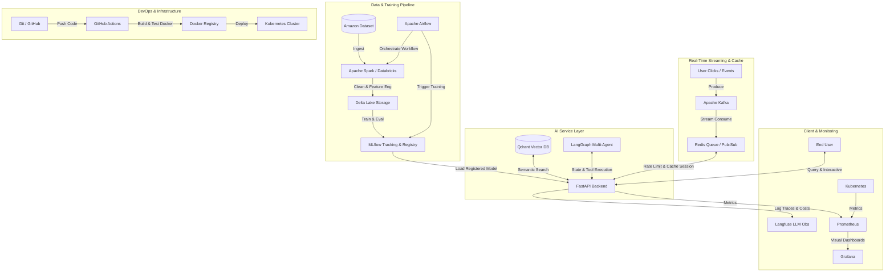

# AI Engineer Roadmap – Modern AI Production Pipeline
## Dự Án Thực Hành: **SmartShop AI Platform**
### *Hệ Thống Gợi Ý Sản Phẩm Thời Gian Thực & Multi-Agent Hỗ Trợ Khách Hàng Thông Minh*

Chào mừng bạn đến với tài liệu hướng dẫn chi tiết dự án **SmartShop AI Platform**. Đây là một dự án mẫu được thiết kế nhằm mục đích học tập, giúp bạn tiếp cận và làm chủ toàn bộ **15 công nghệ cốt lõi** của một **AI Production Pipeline** hiện đại.

Dữ liệu đầu vào sẽ sử dụng **Amazon Product Metadata and Reviews dataset** (phiên bản rút gọn hoặc dữ liệu giả lập có cấu trúc tương đương), là nguồn dữ liệu mở, dễ dàng tải về và chứa đầy đủ cả thông tin cấu trúc (giá, danh mục) lẫn phi cấu trúc (văn bản review, mô tả sản phẩm).

---

## 📐 Kiến Trúc Tổng Thể Hệ Thống (System Architecture)

Dưới đây là luồng xử lý dữ liệu và vận hành của hệ thống từ lúc thu thập, xử lý, huấn luyện cho đến khi phục vụ người dùng cuối:



---

## 🛠️ Lộ Trình Triển Khai 10 Phases Chi Tiết

---

### Phase 1: Source Control & Foundation CI/CD
**Mục tiêu**: Thiết lập môi trường cộng tác chuẩn dự án công nghiệp, tự động hóa quy trình kiểm thử và đóng gói.

*   **Công nghệ sử dụng**: Git, GitHub, GitHub Actions.
*   **Các bước thực hiện**:
    1. Khởi tạo Git repository cục bộ và liên kết với GitHub.
    2. Định nghĩa cấu trúc thư mục dự án chuẩn chỉnh.
    3. Cấu hình GitHub Actions pipeline để chạy Linter (flake8/black) và Unit Test (pytest) tự động mỗi khi có code mới push lên nhánh `main`.

#### Code Minh Họa: Cấu hình GitHub Actions Workflow (`.github/workflows/ci-cd.yml`)
```yaml
name: SmartShop CI/CD Pipeline

on:
  push:
    branches: [ main ]
  pull_request:
    branches: [ main ]

jobs:
  build-and-test:
    runs-on: ubuntu-latest
    steps:
    - name: Checkout code
      uses: actions/checkout@v3

    - name: Set up Python 3.10
      uses: actions/setup-python@v4
      with:
        python-version: "3.10"

    - name: Install dependencies
      run: |
        python -m pip install --upgrade pip
        pip install black pytest flake8
        if [ -f requirements.txt ]; then pip install -r requirements.txt; fi

    - name: Lint with flake8
      run: |
        # stop the build if there are Python syntax errors or undefined names
        flake8 . --count --select=E9,F63,F7,F82 --show-source --statistics
        # exit-zero treats all errors as warnings.
        flake8 . --count --exit-zero --max-complexity=10 --max-line-length=127 --statistics

    - name: Run unit tests
      run: |
        pytest tests/
```

---

### Phase 2: Big Data Ingestion & ETL Pipeline
**Mục tiêu**: Xây dựng pipeline ingest dữ liệu sản phẩm/review có thể chạy được cả local Spark và Databricks, chuẩn hóa dữ liệu thô thành bảng sản phẩm sạch để phục vụ huấn luyện model, semantic search và API ở các phase sau.

*   **Công nghệ sử dụng**: Apache Spark (Databricks) & Apache Airflow.
*   **Các bước thực hiện**:
    1. Viết Spark ETL job nhận tham số input/output qua CLI hoặc biến môi trường, hỗ trợ JSON/JSONL/CSV/Parquet để dễ chạy local và chuyển sang Databricks.
    2. Chuẩn hóa schema sản phẩm: `product_id`, `title`, `description`, `brand`, `category`, `price`, `price_tier`, đồng thời lọc bản ghi thiếu khóa chính hoặc dữ liệu không hợp lệ.
    3. Nếu có dữ liệu review, aggregate `avg_rating` và `review_count` theo sản phẩm để chuẩn bị feature cho Phase 3.
    4. Ghi output dạng Delta Table khi chạy trên Databricks/local có Delta; có thể đổi sang Parquet cho môi trường dev nhẹ hơn.
    5. Tạo Apache Airflow DAG lập lịch Daily ETL, truyền tham số vào Databricks job qua biến môi trường thay vì hard-code cluster/path trong code.

#### Code Minh Họa: Spark ETL Job (`jobs/spark_etl.py`)
```python
from jobs.spark_etl import parse_args, run_etl

if __name__ == "__main__":
    run_etl(parse_args())
```

#### Code Minh Họa: Airflow DAG (`dags/etl_scheduler.py`)
```python
from dags.etl_scheduler import dag
```

> Triển khai thật nằm trong `jobs/spark_etl.py` và `dags/etl_scheduler.py`; roadmap chỉ giữ snippet ngắn để tránh tài liệu bị lệch khỏi code khi pipeline phát triển.

#### Ghi Chú Chạy Phase 2 Bằng Ubuntu WSL Trên Windows

Spark local trên Windows có thể gặp lỗi `HADOOP_HOME` / `winutils.exe`. Cách đơn giản hơn là chạy Phase 2 trong Ubuntu WSL:

```powershell
wsl -d Ubuntu
```

Trong Ubuntu, đi tới project trên ổ `D:`:

```bash
cd /mnt/d/ANNGUYEN/Project/AI_Application
```

Cài Java và tạo virtual environment. Không nên tạo `.venv` trực tiếp trong `/mnt/d` vì filesystem Windows có thể lỗi symlink `lib -> lib64`; hãy tạo venv trong filesystem Linux:

```bash
sudo apt update
sudo apt install -y openjdk-17-jdk python3-venv
mkdir -p /root/.venvs
python3 -m venv /root/.venvs/ai_application
. /root/.venvs/ai_application/bin/activate
python -m pip install --upgrade pip
python -m pip install pytest black flake8 pyspark
```

Nếu shell là `bash`, có thể dùng `source /root/.venvs/ai_application/bin/activate`; nếu shell là `sh`, dùng dấu chấm `.` như lệnh ở trên.

Chạy test và ETL local:

```bash
python -m pytest tests/test_spark_etl_config.py
rm -rf data/processed/amazon_reviews_2023_flow_smoke
python -m jobs.spark_etl \
  --input-products data/raw/amazon_reviews_2023/combined/meta.jsonl \
  --input-reviews data/raw/amazon_reviews_2023/combined/reviews.jsonl \
  --output-path data/processed/amazon_reviews_2023_flow_smoke \
  --output-format parquet \
  --master "local[*]"
ls -la data/processed/amazon_reviews_2023_flow_smoke
```

#### Ghi Chú Chạy Project Bằng Conda Trên PowerShell

Nếu muốn chạy project trực tiếp trên PowerShell thay vì dùng WSL, hãy dùng Conda environment riêng để tránh làm bẩn môi trường `base`:

```powershell
cd D:\ANNGUYEN\Project\AI_Application
conda env create -f environment.yml
conda activate smartshop-ai
python -m pytest
```

Nếu đã tạo env trước đó và muốn cập nhật theo `environment.yml` mới:

```powershell
conda activate smartshop-ai
conda env update -f environment.yml --prune
```

Chạy Phase 3 trên PowerShell:

```powershell
python -m src.train `
  --input-path data/processed/amazon_reviews_2023_flow_smoke `
  --tracking-uri sqlite:///mlflow.db `
  --experiment-name SmartShop_Rating_Classification `
  --model-name SmartShopRatingClassifier
mlflow ui --backend-store-uri sqlite:///mlflow.db
```

Lưu ý: Spark local trên Windows vẫn có thể cần `HADOOP_HOME` và `winutils.exe` khi ghi Parquet/Delta. Nếu chưa cấu hình Hadoop helper, ưu tiên chạy ETL Phase 2 bằng Ubuntu WSL như hướng dẫn phía trên; Conda PowerShell phù hợp nhất để chạy unit test, Phase 3 training và MLflow UI.

---

### Phase 3: Experiment Tracking & Model Registry
**Mục tiêu**: Huấn luyện baseline model từ dữ liệu processed của Phase 2, log thí nghiệm bằng MLflow và tạo nền tảng để so sánh các model nâng cao ở những vòng sau.

*   **Công nghệ sử dụng**: Scikit-learn, Pandas, PyArrow, MLflow.
*   **Các bước thực hiện**:
    1. Đọc bảng `data/processed/amazon_reviews_2023_flow_smoke` do Phase 2 sinh ra.
    2. Tạo text feature từ `title`, `description`, `brand`, `category`, `price_tier`.
    3. Tạo nhãn baseline: `avg_rating >= 4.0` là sản phẩm rating cao.
    4. Train pipeline `TfidfVectorizer + LogisticRegression`.
    5. Log params, metrics và model artifact vào MLflow local (`sqlite:///mlflow.db`); có thể bật đăng ký model bằng `--register-model` when cần.

#### Cách Chạy Phase 3 (`src/train.py`)
```bash
python -m pip install -r requirements.txt
python -m src.train \
  --input-path data/processed/amazon_reviews_2023_flow_smoke \
  --tracking-uri sqlite:///mlflow.db \
  --experiment-name SmartShop_Rating_Classification \
  --model-name SmartShopRatingClassifier \
  --register-model \
  --registry-alias candidate
mlflow ui --backend-store-uri sqlite:///mlflow.db
```

#### MLflow Model Registry Workflow
Sau khi train xong, model version mới sẽ được đăng ký dưới tên
`SmartShopRatingClassifier` và gắn alias `candidate`. Mở MLflow UI để so sánh
metrics; khi muốn chọn model tốt nhất cho các phase API/deployment, promote
candidate thành champion:

```bash
python -m src.model_registry list \
  --tracking-uri sqlite:///mlflow.db \
  --model-name SmartShopRatingClassifier

python -m src.model_registry promote \
  --tracking-uri sqlite:///mlflow.db \
  --model-name SmartShopRatingClassifier \
  --source-alias candidate \
  --alias champion
```

Các phase sau có thể load model production bằng URI:

```text
models:/SmartShopRatingClassifier@champion
```

---

### Phase 4: Vector Database & Semantic Search
**Mục tiêu**: Xây dựng tính năng tìm kiếm sản phẩm thông minh bằng ngôn ngữ tự nhiên (Semantic Search).

*   **Công nghệ sử dụng**: Qdrant Vector Database.
*   **Các bước thực hiện**:
    1. Sử dụng thư viện `sentence-transformers` để sinh embedding vector (kích thước 384 hoặc 768) từ tiêu đề và mô tả sản phẩm.
    2. Khởi tạo một Collection trên Qdrant và tải các vector lên cùng thông tin bổ sung (payload: price, brand, category).
    3. Viết hàm truy vấn Hybrid Search: vừa khớp ngữ nghĩa (vector similarity), vừa lọc thuộc tính (filter giá/danh mục).

#### Code Minh Họa: Quản lý Vector với Qdrant (`src/vector_store.py`)
```python
from qdrant_client import QdrantClient
from qdrant_client.models import Distance, VectorParams, PointStruct, Filter, FieldCondition, MatchValue
from sentence_transformers import SentenceTransformer

class VectorSearchService:
    def __init__(self):
        # Kết nối tới Qdrant local chạy bằng Docker
        self.client = QdrantClient(host="localhost", port=6333)
        self.encoder = SentenceTransformer("all-MiniLM-L6-v2") # Vector size 384
        self.collection_name = "products"

    def init_collection(self):
        # Tạo Collection mới nếu chưa tồn tại
        if not self.client.collection_exists(self.collection_name):
            self.client.create_collection(
                collection_name=self.collection_name,
                vectors_config=VectorParams(size=384, distance=Distance.COSINE),
            )
            print(f"Collection '{self.collection_name}' created.")

    def index_products(self, products):
        """
        products: list các dict chứa product_id, title, description, price, category
        """
        points = []
        for i, prod in enumerate(products):
            text_to_encode = f"{prod['title']}: {prod['description']}"
            vector = self.encoder.encode(text_to_encode).tolist()
            
            points.append(
                PointStruct(
                    id=i,
                    vector=vector,
                    payload={
                        "product_id": prod["product_id"],
                        "title": prod["title"],
                        "price": prod["price"],
                        "category": prod["category"]
                    }
                )
            )
        
        self.client.upsert(collection_name=self.collection_name, points=points)
        print(f"Indexed {len(points)} products.")

    def search_products(self, query: str, category_filter: str = None, top_k: int = 3):
        query_vector = self.encoder.encode(query).tolist()
        
        # Thiết lập filter lọc theo Category nếu được chỉ định (Hybrid Search)
        query_filter = None
        if category_filter:
            query_filter = Filter(
                must=[
                    FieldCondition(
                        key="category",
                        match=MatchValue(value=category_filter)
                    )
                ]
            )

        results = self.client.search(
            collection_name=self.collection_name,
            query_vector=query_vector,
            query_filter=query_filter,
            limit=top_k
        )
        return [hit.payload for hit in results]

# Demo chạy thử
if __name__ == "__main__":
    search_service = VectorSearchService()
    search_service.init_collection()
    
    # Dữ liệu mẫu
    sample_data = [
        {"product_id": "P01", "title": "Wireless Noise Cancelling Headphones", "description": "High fidelity audio with long battery life.", "price": 150.0, "category": "Electronics"},
        {"product_id": "P02", "title": "Ergonomic Office Chair", "description": "Comfortable mesh back support chair for home office.", "price": 200.0, "category": "Furniture"}
    ]
    search_service.index_products(sample_data)
    
    # Tìm kiếm
    hits = search_service.search_products("noise cancelling headphones", category_filter="Electronics")
    print("Search Results:", hits)
```

---

#### Ghi Chú Triển Khai Phase 4 Trong Repo

Phần hiện thực nằm trong `src/vector_store.py`, gồm:

* `VectorSearchService`: khởi tạo collection, index sản phẩm và semantic search.
* `SentenceTransformerEncoder`: sinh embedding bằng `sentence-transformers/all-MiniLM-L6-v2`.
* `QdrantVectorBackend`: adapter Qdrant, hỗ trợ tạo collection và upsert/search vector.
* `ProductSearchFilters`: lọc kết quả theo `category`, `brand`, `min_price`, `max_price`.

Chạy Qdrant local bằng Docker:

```bash
docker run -p 6333:6333 -p 6334:6334 qdrant/qdrant
```

Index dữ liệu đã xử lý từ Phase 2:

```bash
python -m src.vector_store index \
  --input-path data/processed/amazon_reviews_2023_flow_smoke \
  --collection-name products
```

Truy vấn semantic search:

```bash
python -m src.vector_store search "noise cancelling headphones" \
  --category Electronics \
  --top-k 5
```

Kiểm thử Phase 4 không cần Qdrant server thật:

```bash
python -m pytest tests/test_vector_store_phase4.py
```

---

### Phase 5: Real-time Ingestion & Messaging (Optional nhưng tích hợp)
**Mục tiêu**: Xử lý dữ liệu tương tác của người dùng (Clickstream, Search Query) theo thời gian thực để phân tích hành vi và cập nhật danh sách "sản phẩm hot".

*   **Công nghệ sử dụng**: Apache Kafka.
*   **Các bước thực hiện**:
    1. Thiết lập Kafka Topic `user-clicks`.
    2. FastAPI đóng vai trò là Producer, đẩy thông tin click của user lên Kafka khi họ tương tác.
    3. Viết một Consumer chạy nền để nhận dữ liệu clickstream, đếm số lượt view của sản phẩm và gửi thống kê qua Redis.

#### Code Minh Họa: Gửi và Nhận Event với Kafka (`src/streaming.py`)
```python
import json
from kafka import KafkaProducer, KafkaConsumer

# 1. Kafka Producer (Tích hợp trong Web Server)
class ClickEventProducer:
    def __init__(self):
        self.producer = KafkaProducer(
            bootstrap_servers=['localhost:9092'],
            value_serializer=lambda v: json.dumps(v).encode('utf-8')
        )

    def log_click(self, user_id: str, product_id: str):
        event = {"user_id": user_id, "product_id": product_id, "timestamp": "2026-07-06T22:24:49"}
        self.producer.send('user-clicks', value=event)
        self.producer.flush()
        print(f"Logged click event for product: {product_id}")

# 2. Kafka Consumer (Background Worker)
def run_click_consumer():
    consumer = KafkaConsumer(
        'user-clicks',
        bootstrap_servers=['localhost:9092'],
        auto_offset_reset='earliest',
        value_deserializer=lambda x: json.loads(x.decode('utf-8'))
    )
    print("Consumer started. Listening for click events...")
    for message in consumer:
        event = message.value
        # Thực hiện cập nhật số lượt tương tác hoặc gợi ý thời gian thực tại đây
        print(f"Processing real-time recommendation for User {event['user_id']} based on Product {event['product_id']}")

if __name__ == "__main__":
    # Test nhanh Consumer
    # run_click_consumer()
    pass
```

#### Ghi Chu Trien Khai Phase 5 Trong Repo

Phan hien thuc nam trong `src/streaming.py`, gom:

* `ClickEvent`: schema va validation cho event click/search cua user.
* `KafkaClickEventProducer`: producer gui event vao topic `user-clicks`.
* `ClickEventConsumer`: consumer doc Kafka message va cap nhat thong ke realtime.
* `RedisHotProductsStore`: luu bang xep hang san pham hot bang Redis sorted set.

Chay Kafka va Redis local, sau do gui mot event click:

```bash
python -m src.streaming produce \
  --user-id U01 \
  --product-id P01 \
  --session-id S01 \
  --query "noise cancelling headphones"
```

Chay consumer nen de cap nhat hot products:

```bash
python -m src.streaming consume
```

Xem top san pham hot tu Redis:

```bash
python -m src.streaming top --limit 10
```

Kiem thu Phase 5 khong can Kafka/Redis that:

```bash
python -m pytest tests/test_streaming_phase5.py
```

---

### Phase 6: Cache, Session & Queue Layer
**Mục tiêu**: Tăng tốc độ phản hồi của API, lưu giữ trạng thái hội thoại và kiểm soát lưu lượng truy cập hệ thống.

*   **Công nghệ sử dụng**: Redis (Cache, Session, Rate Limiting).
*   **Các bước thực hiện**:
    1. **Cache**: Lưu kết quả tìm kiếm ngữ nghĩa của Qdrant vào Redis với thời gian hết hạn (TTL). Nếu trùng từ khóa tìm kiếm, trả ngay kết quả từ Cache.
    2. **Session**: Lưu trạng thái bộ nhớ (state memory) của AI Agent để xử lý đa phiên hội thoại.
    3. **Rate Limiting**: Thiết lập thuật toán Token Bucket / Fixed Window để chặn spam API từ IP hoặc User.

#### Code Minh Họa: Redis Helper (`src/cache_service.py`)
```python
import redis
import json

class RedisService:
    def __init__(self):
        # Kết nối tới Redis local
        self.client = redis.Redis(host='localhost', port=6379, db=0, decode_responses=True)

    # 1. Caching
    def get_cached_search(self, query: str):
        cached_val = self.client.get(f"search:{query}")
        return json.loads(cached_val) if cached_val else None

    def set_cached_search(self, query: str, results: list, ttl: int = 300):
        self.client.setex(f"search:{query}", ttl, json.dumps(results))

    # 2. Rate Limiting (Fixed Window)
    def check_rate_limit(self, user_ip: str, limit: int = 10, window: int = 60) -> bool:
        key = f"rate:{user_ip}"
        current = self.client.get(key)
        if current and int(current) >= limit:
            return False  # Bị chặn
        
        # Nếu chưa vượt quá, tăng biến đếm thêm 1
        pipe = self.client.pipeline()
        pipe.incr(key)
        if not current:
            pipe.expire(key, window)
        pipe.execute()
        return True
```

#### Ghi Chu Trien Khai Phase 6 Trong Repo

Phan hien thuc nam trong `src/cache_service.py`, gom:

* `RedisService`: helper dung chung cho cache search, session memory va fixed-window rate limiting.
* `RedisConfig`: cau hinh host/port/db, key prefix, TTL cache/session va gioi han rate limit mac dinh.
* `SessionMessage`: schema message hoi thoai luu trong Redis list theo tung `session_id`.
* `RateLimitResult`: ket qua rate limit gom `allowed`, `remaining` va `reset_after_seconds`.

Cache ket qua search:

```bash
python -m src.cache_service cache-set \
  --query "noise cancelling headphones" \
  --results-json '[{"product_id":"P01","score":0.91}]'

python -m src.cache_service cache-get \
  --query "noise cancelling headphones"
```

Luu va doc session hoi thoai:

```bash
python -m src.cache_service session-add \
  --session-id S01 \
  --role user \
  --content "show me wireless headphones"

python -m src.cache_service session-get --session-id S01
```

Kiem tra rate limit:

```bash
python -m src.cache_service rate-check \
  --identity 127.0.0.1 \
  --limit 10 \
  --window-seconds 60
```

Kiem thu Phase 6 khong can Redis server that:

```bash
python -m pytest tests/test_cache_service_phase6.py
```

---

### Phase 7: AI Agent Framework Development
**Mục tiêu**: Xây dựng AI Agent hỗ trợ khách hàng đa năng: có khả năng gọi tool tìm kiếm sản phẩm (Qdrant), trả lời chính sách mua hàng, và hỗ trợ chuyển tiếp lên người thật (Human-in-the-loop) khi gặp trường hợp phức tạp.

*   **Công nghệ sử dụng**: LangGraph (Multi-Agent, Tool Calling, Stateful).
*   **Các bước thực hiện**:
    1. Định nghĩa trạng thái hội thoại (State) chứa lịch sử tin nhắn và cờ trạng thái.
    2. Tạo các Tools: `search_products_tool` để truy vấn vector Qdrant.
    3. Định nghĩa đồ thị điều hướng hội thoại (Graph): quyết định xem LLM cần gọi tool, trả lời ngay, hay yêu cầu "Human-in-the-loop" duyệt trước khi thực thi.

#### Code Minh Họa: LangGraph Workflow (`src/agent.py`)
```python
from typing import Annotated, TypedDict, List
from langgraph.graph import StateGraph, END
from langchain_core.messages import BaseMessage, HumanMessage, AIMessage
from langchain_openai import ChatOpenAI
from langchain_core.tools import tool

# 1. Định nghĩa State của Agent
class AgentState(TypedDict):
    messages: List[BaseMessage]
    next_action: str
    approved_by_human: bool

# 2. Định nghĩa Tool tìm kiếm sản phẩm kết nối với Qdrant
@tool
def search_products(query: str) -> str:
    """Sử dụng công cụ này để tìm kiếm sản phẩm trong catalog theo từ khóa của khách hàng."""
    from src.vector_store import VectorSearchService
    search_service = VectorSearchService()
    hits = search_service.search_products(query, top_k=2)
    return f"Kết quả tìm kiếm sản phẩm: {str(hits)}"

tools = {"search_products": search_products}
llm = ChatOpenAI(model="gpt-4o-mini").bind_tools([search_products])

# 3. Định nghĩa các Node trong Graph
def call_model(state: AgentState):
    messages = state['messages']
    response = llm.invoke(messages)
    return {"messages": messages + [response]}

def human_check(state: AgentState):
    # Node đại diện cho Human-in-the-loop để phê duyệt hành động
    # Nếu tin nhắn cuối chứa lời kêu gọi tool đặc biệt
    last_message = state['messages'][-1]
    if last_message.tool_calls:
        # Tạm dừng để chờ phê duyệt
        return {"next_action": "wait_for_approval"}
    return {"next_action": "continue"}

def execute_tools(state: AgentState):
    last_message = state['messages'][-1]
    tool_messages = []
    for tool_call in last_message.tool_calls:
        tool_name = tool_call['name']
        tool_args = tool_call['args']
        tool_instance = tools[tool_name]
        result = tool_instance.invoke(tool_args)
        tool_messages.append(AIMessage(content=f"Tool output: {result}"))
    
    return {"messages": state['messages'] + tool_messages, "approved_by_human": False}

# 4. Xây dựng StateGraph
workflow = StateGraph(AgentState)

workflow.add_node("agent", call_model)
workflow.add_node("human_check", human_check)
workflow.add_node("tools", execute_tools)

workflow.set_entry_point("agent")

# Định nghĩa luồng chuyển tiếp có điều kiện
def router(state: AgentState):
    if state["next_action"] == "wait_for_approval" and not state["approved_by_human"]:
        return "human_check"
    elif state['messages'][-1].tool_calls:
        return "tools"
    else:
        return END

workflow.add_conditional_edges("agent", router)
workflow.add_edge("tools", "agent")
workflow.add_edge("human_check", "agent")

app = workflow.compile()
```

---

### Phase 8: API Layer Development
**Mục tiêu**: Xây dựng máy chủ API RESTful để kết nối ứng dụng với giao diện người dùng, hỗ trợ Streaming phản hồi từ LLM và upload file dữ liệu sản phẩm.

*   **Công nghệ sử dụng**: FastAPI (Async, WebSockets/Streaming, Authentication).
*   **Các bước thực hiện**:
    1. Viết API Endpoint `/search` (tích hợp Redis Cache và Qdrant Search).
    2. Viết API Endpoint `/chat` hỗ trợ Streaming Response (server-sent events) trả kết quả hội thoại từ Agent.
    3. Endpoint `/upload` nhận file CSV danh mục sản phẩm mới tải lên để kích hoạt Spark/Databricks job xử lý ngầm.
    4. Thêm middleware Authentication (JWT) và Rate Limiting.

#### Code Minh Họa: FastAPI Application (`src/main.py`)
```python
from fastapi import FastAPI, Depends, HTTPException, status, UploadFile, File
from fastapi.responses import StreamingResponse
from fastapi.security import OAuth2PasswordBearer
from src.vector_store import VectorSearchService
from src.cache_service import RedisService
import asyncio

app = FastAPI(title="SmartShop AI API Layer")
search_service = VectorSearchService()
redis_service = RedisService()
oauth2_scheme = OAuth2PasswordBearer(tokenUrl="token")

# Giả lập xác thực người dùng
def get_current_user(token: str = Depends(oauth2_scheme)):
    if token != "valid-token-secret":
        raise HTTPException(status_code=status.HTTP_401_UNAUTHORIZED, detail="Invalid token")
    return "admin-user"

@app.get("/search")
async def search(query: str, category: str = None):
    # 1. Kiểm tra cache trong Redis trước
    cached_res = redis_service.get_cached_search(query)
    if cached_res:
        return {"results": cached_res, "source": "cache"}

    # 2. Gọi Qdrant search
    results = search_service.search_products(query, category_filter=category)
    
    # 3. Ghi vào cache Redis
    redis_service.set_cached_search(query, results)
    return {"results": results, "source": "db"}

@app.post("/catalog/upload")
async def upload_catalog(file: UploadFile = File(...), user: str = Depends(get_current_user)):
    # Đọc file upload và xử lý
    contents = await file.read()
    # Chuyển tiếp file cho Spark xử lý
    return {"filename": file.filename, "status": "Uploaded successfully. Triggering ETL pipeline."}

@app.get("/chat/stream")
async def chat_stream(message: str):
    # Streaming Response (Giả lập sinh text từ LLM từng phần)
    async def event_generator():
        response_text = f"Chào bạn! Tôi đã nhận được câu hỏi: '{message}'. Đây là phản hồi từ Agent..."
        for word in response_text.split():
            yield f"data: {word} \n\n"
            await asyncio.sleep(0.15) # Giả lập delay sinh từ
            
    return StreamingResponse(event_generator(), media_type="text/event-stream")
```

---

#### Ghi Chu Trien Khai Phase 8 Trong Repo

Phan hien thuc nam trong `src/main.py`, gom:

* `create_app`: FastAPI app factory ho tro inject fake Redis/Qdrant/Agent/ETL runner cho test.
* `/search`: tim kiem san pham bang Qdrant, cache ket qua bang Redis va ho tro filter `category`, `brand`, `min_price`, `max_price`.
* `/chat` va `/chat/stream`: Server-Sent Events streaming ket qua tu `SmartShopAgent`, dong thoi luu session memory vao Redis khi co `session_id`.
* `/upload` va `/catalog/upload`: nhan file CSV catalog, luu vao `data/uploads/catalog`, tao manifest va chay ETL background qua `jobs.spark_etl` hoac command duoc cau hinh bang `SMARTSHOP_ETL_COMMAND`.
* CORS cau hinh qua `SMARTSHOP_CORS_ORIGINS` de frontend that goi API an toan, khong dung wildcard mac dinh.
* Authentication bang Bearer JWT voi issuer/JWKS/public key RS256 cho production; HS256 secret chi la fallback dev/local/test.
* Fixed-window/token-bucket rate limit qua Redis.

Tao token local de goi API tu Python:

```bash
python - <<'PY'
from src.main import create_access_token
print(create_access_token("admin-user"))
PY
```

Chay API:

```bash
uvicorn src.main:app --reload
```

Goi search co authentication:

```bash
curl -H "Authorization: Bearer <TOKEN>" \
  "http://localhost:8000/search?query=noise%20cancelling%20headphones&category=Electronics&top_k=5"
```

Kiem thu Phase 8 khong can Redis/Qdrant that:

```bash
python -m pytest tests/test_api_phase8.py
```

Kiem thu integration voi Redis/Qdrant container that:

```bash
SMARTSHOP_RUN_CONTAINER_TESTS=1 python -m pytest tests/test_api_phase8_integration.py
```

---

### Phase 9: Containerization & Orchestration
**Mục tiêu**: Đóng gói toàn bộ mã nguồn cùng thư viện phụ thuộc thành các Docker Container chuẩn hóa và vận hành chúng thông qua Kubernetes (K8s).

*   **Công nghệ sử dụng**: Docker, Docker Compose, Kubernetes.
*   **Các bước thực hiện**:
    1. Viết `Dockerfile` tối ưu hóa đa tầng (multi-stage build) để giảm dung lượng file ảnh.
    2. Viết file `docker-compose.yml` để dựng nhanh môi trường local đầy đủ (FastAPI, Redis, Qdrant, Kafka).
    3. Viết các tệp Manifest K8s (`Deployment`, `Service`, `HorizontalPodAutoscaler`) để triển khai dịch vụ API lên môi trường production tự động scale khi tải cao.

#### Code Minh Họa: Dockerfile (`Dockerfile`)
```dockerfile
# Stage 1: Build dependencies
FROM python:3.10-slim as builder
WORKDIR /app
COPY requirements.txt .
RUN pip install --no-cache-dir --user -r requirements.txt

# Stage 2: Final lightweight image
FROM python:3.10-slim
WORKDIR /app
COPY --from=builder /root/.local /root/.local
COPY . .
ENV PATH=/root/.local/bin:$PATH
EXPOSE 8000
CMD ["uvicorn", "src.main:app", "--host", "0.0.0.0", "--port", "8000"]
```

#### Code Minh Họa: Kubernetes Deployment (`k8s/api-deployment.yaml`)
```yaml
apiVersion: apps/v1
kind: Deployment
metadata:
  name: smartshop-api
  labels:
    app: smartshop-api
spec:
  replicas: 3
  selector:
    matchLabels:
      app: smartshop-api
  template:
    metadata:
      labels:
        app: smartshop-api
    spec:
      containers:
      - name: api-container
        image: smartshop-api:latest
        ports:
        - containerPort: 8000
        env:
        - name: REDIS_HOST
          value: "redis-service"
        - name: QDRANT_HOST
          value: "qdrant-service"
        resources:
          limits:
            cpu: "1"
            memory: "1Gi"
          requests:
            cpu: "0.5"
            memory: "512Mi"
---
apiVersion: v1
kind: Service
metadata:
  name: smartshop-api-service
spec:
  type: LoadBalancer
  ports:
  - port: 80
    targetPort: 8000
  selector:
    app: smartshop-api
```

#### Ghi Chu Trien Khai Phase 9 Trong Repo

Phan hien thuc nam trong cac file:

* `Dockerfile`: multi-stage image Python 3.11, cai dependencies trong virtualenv, chay non-root user `smartshop`, expose port `8000` va healthcheck `/health`.
* `requirements-api.txt`: dependency runtime nhe cho API container; Spark/Delta/MLflow, PyTorch va `sentence-transformers` van nam trong `requirements.txt` / `environment.yml`.
* `.dockerignore`: loai bo `.git`, cache, virtualenv, MLflow artifacts va data output de image nhe hon.
* `docker-compose.yml`: dung local stack gom `api`, `redis`, `qdrant`, `kafka` va persistent volumes.
* `k8s/`: manifest Kustomize cho `smartshop-api`, `redis`, `qdrant`, `kafka`, `Service` va `HorizontalPodAutoscaler`.
* `src/cache_service.py`, `src/vector_store.py`, `src/streaming.py`: ho tro doc cau hinh tu bien moi truong nhu `REDIS_HOST`, `QDRANT_HOST`, `KAFKA_BOOTSTRAP_SERVERS`.

Luu y ve encoder search trong API image:

* `docker-compose.yml` va `k8s/api-deployment.yaml` dat `SMARTSHOP_EMBEDDING_BACKEND=hashing`.
* `HashingTextEncoder` la encoder nhe, deterministic, khong can `sentence-transformers`/PyTorch, phu hop de demo Docker va kiem tra pipeline `/search`.
* Chat luong semantic search cua hashing khong bang embedding that. Neu can ket qua production-quality, build image runtime rieng co `sentence-transformers` va dat `SMARTSHOP_EMBEDDING_BACKEND=sentence-transformers`, dong thoi index lai collection Qdrant bang cung encoder.

Luu y ve Qdrant va du lieu search:

* Container Qdrant moi khoi dong chi tao service, khong tu co du lieu san pham. Neu collection rong thi `/search` se khong tra ket qua co y nghia.
* Co the index du lieu that tu `data/processed/amazon_reviews_2023_flow_smoke` bang service `vector-indexer` trong Compose. Mac dinh indexer dung hashing de khop voi API image nhe; neu dung embedding that, hay build API bang target `full-runtime`, set API va indexer cung `SMARTSHOP_EMBEDDING_BACKEND=sentence-transformers`, roi index lai collection.
* Sau khi index lai, Redis co the van giu cache ket qua search cu. Xoa cache bang `docker compose exec -T redis redis-cli FLUSHDB`.

Chay local bang Docker Compose:

```bash
docker compose up --build -d
docker compose ps
curl http://localhost:8000/health
```

Index Qdrant tu du lieu processed:

```bash
docker compose --profile indexer run --rm vector-indexer
docker compose exec -T redis redis-cli FLUSHDB
```

Dung embedding that trong Docker cho ca index va `/search`:

```bash
SMARTSHOP_API_BUILD_TARGET=full-runtime \
SMARTSHOP_EMBEDDING_BACKEND=sentence-transformers \
SMARTSHOP_INDEX_EMBEDDING_BACKEND=sentence-transformers \
docker compose up --build -d api qdrant redis

SMARTSHOP_INDEX_EMBEDDING_BACKEND=sentence-transformers \
docker compose --profile indexer run --rm vector-indexer
docker compose exec -T redis redis-cli FLUSHDB
```

Tao JWT dev token roi goi API:

```bash
docker compose exec api python - <<'PY'
from src.main import create_access_token
print(create_access_token("admin-user"))
PY

curl -H "Authorization: Bearer <TOKEN>" \
  "http://localhost:8000/search?query=noise%20cancelling%20headphones&top_k=5"
```

Build image va deploy len Kubernetes local:

```bash
docker build -t smartshop-api:latest .
kubectl apply -k k8s/
kubectl get pods,svc,hpa
```

Kiem thu Phase 9:

```bash
docker compose config
python -m pytest tests/test_deployment_phase9.py
```

Luu y: API container trong `docker-compose.yml` duoc toi uu de boot nhanh cho backend runtime va demo search bang hashing encoder. Endpoint upload co the trigger ETL bang command cau hinh trong `SMARTSHOP_ETL_COMMAND`; neu command mac dinh can Spark day du, hay chay bang Conda/venv theo `requirements.txt` hoac tach thanh image worker rieng cho production pipeline.

Luu y ve Kafka va K8s:

* API da co endpoint `POST /events/click` de publish click event vao Kafka neu broker san sang; neu Kafka khong san sang endpoint van accept event de frontend khong bi block.
* Manifest trong `k8s/` la ban hoc tap/local de hieu Deployment/Service/HPA. Production that nen bo sung Secret that cho JWT, PersistentVolume/StatefulSet cho Qdrant va Kafka, Ingress/TLS, resource tuning, readiness/liveness sau hon, va managed Kafka hoac Kafka operator.

---

### Phase 10: Monitoring & Observability
**Mục tiêu**: Theo dõi tài nguyên hệ thống (CPU, RAM, API Metrics) và quan sát chi tiết hoạt động của LLM (prompts, completion tokens, latency, cost).

*   **Công nghệ sử dụng**: Prometheus, Grafana & Langfuse.
*   **Các bước thực hiện**:
    1. Tích hợp thư viện `prometheus-fastapi-instrumentator` vào FastAPI để expose endpoint `/metrics`.
    2. Cấu hình Grafana Dashboard để hiển thị biểu đồ CPU, RAM, Latency và Error Rate.
    3. Tích hợp Langfuse SDK vào FastAPI / LangGraph để lưu trace các cuộc gọi LLM, tính toán số token tiêu thụ, chi phí (cost) và chấm điểm chất lượng câu trả lời (Evaluation).

#### Code Minh Họa: Tích hợp Prometheus & Langfuse (`src/monitoring.py`)
```python
from fastapi import FastAPI
from prometheus_fastapi_instrumentator import Instrumentator
from langfuse.decorators import observe, langfuse_context

app = FastAPI(title="Observed SmartShop API")

# 1. Kích hoạt Prometheus Metrics
Instrumentator().instrument(app).expose(app, endpoint="/metrics")

# 2. Tích hợp Langfuse Observability
# Chỉ cần thêm decorator @observe() vào các hàm gọi LLM để tự động trace
@observe()
async def call_llm_with_trace(prompt: str):
    # Gửi metadata lên Langfuse
    langfuse_context.update_current_trace(
        user_id="user-123",
        tags=["production", "chat-support"]
    )
    
    # Giả lập gọi LLM OpenAI
    from langchain_openai import ChatOpenAI
    llm = ChatOpenAI(model="gpt-4o-mini")
    response = llm.invoke(prompt)
    
    # Trả về kết quả
    return response.content

@app.get("/ask")
async def ask_agent(query: str):
    answer = await call_llm_with_trace(query)
    return {"answer": answer}
```

---

#### Ghi Chú Triển Khai Phase 10 Trong Repo

Phần hiện thực nằm trong các file:

* `src/monitoring.py`: `MonitoringService`, `LangfuseTracer`, `PrometheusConfig`, `LangfuseConfig`, context managers `track_search` / `track_llm_call`, module-level `@observe` decorator.
* `src/main.py`: `create_app` tích hợp `MonitoringService.instrument(app)` để expose `/metrics`; `lifespan` gọi `monitoring.flush()` khi shutdown.
* `requirements-api.txt`: thêm `prometheus-fastapi-instrumentator>=6.1.0`, `prometheus-client>=0.19.0`, `langfuse>=2.0.0`.
* `docker-compose.yml`: thêm service `prometheus` (port `9090`) và `grafana` (port `3000`).
* `monitoring/prometheus.yml`: cấu hình scrape `smartshop-api` tại `/metrics` mỗi 10 giây.
* `monitoring/grafana/provisioning/datasources/prometheus.yml`: auto-provision Prometheus datasource.
* `monitoring/grafana/provisioning/dashboards/smartshop_dashboard.json`: dashboard sẵn sàng với panels: Request Rate, Error Rate, P95 Latency, Search Cache Hit Rate, LLM Token Usage, LLM Latency.

Dựng toàn bộ stack bao gồm Prometheus và Grafana:

```bash
docker compose up --build -d
docker compose ps
```

Truy cập các endpoint:

```
http://localhost:8000/metrics     # Raw Prometheus metrics từ FastAPI
http://localhost:9090             # Prometheus UI
http://localhost:3000             # Grafana Dashboard (admin/admin)
```

Kích hoạt Langfuse tracing bằng cách đặt biến môi trường trong `.env`:

```env
LANGFUSE_PUBLIC_KEY=pk-lf-...
LANGFUSE_SECRET_KEY=sk-lf-...
LANGFUSE_HOST=https://cloud.langfuse.com   # hoặc self-hosted
```

Neu `LANGFUSE_PUBLIC_KEY` hoac `LANGFUSE_SECRET_KEY` bi bo trong, `LangfuseTracer` se tu tat tracing va API van chay binh thuong. Chi khi co key that thi trace LLM moi duoc gui len Langfuse.
Docker Compose se doc `.env` va truyen cac bien nay vao container API. Neu chay local bang `uvicorn --reload`, hay export bien moi truong trong shell hoac chay `uvicorn src.main:app --reload --env-file .env`.

Luu y ve Grafana dashboard:

* `/metrics` duoc expose truc tiep tu FastAPI tai `http://localhost:8000/metrics`.
* Khi chay local dev bang `uvicorn --reload`, Prometheus khong tu scrape endpoint nay nen dashboard Grafana co the hien `No data`.
* Muon cac panel co data, chay du stack bang `docker compose up --build -d` de Prometheus scrape `api:8000/metrics`, sau do tao mot vai request vao `/search`, `/chat`, `/upload` hoac `/events/click`.

Kiểm tra trạng thái monitoring module:

```bash
python -m src.monitoring status
```

Kiểm thử Phase 10:

```bash
python -m pytest tests/test_monitoring_phase10.py -v
```

---

## 🔒 Production Hardening (P0/P1/P2 Đã Triển Khai)

Các thay đổi nâng dự án từ demo local lên gần production-ready:

**Độ tin cậy (P0):**

* Qdrant/Redis **không còn âm thầm fallback sang in-memory** ngoài môi trường `dev/local/test`. Trên prod, mất kết nối sẽ trả lỗi rõ ràng thay vì phục vụ dữ liệu rỗng. Override demo bằng `SMARTSHOP_QDRANT_ALLOW_MEMORY_FALLBACK` / `SMARTSHOP_REDIS_ALLOW_MEMORY_FALLBACK`.
* `/health/ready` kiểm tra cả Qdrant khi `SMARTSHOP_READINESS_CHECK_QDRANT=true` (bật sẵn trong Compose; mặc định bật ngoài dev).
* K8s: Redis/Qdrant/Kafka chuyển sang **StatefulSet + PVC**; Redis bật AOF (`--appendonly yes`) nên session/approvals sống qua pod restart.
* Upload ETL: runtime image không có Spark sẽ **fail nhanh với thông báo rõ ràng** trong manifest thay vì chạy lệnh chắc chắn lỗi; theo dõi trạng thái qua `GET /catalog/uploads` và `GET /catalog/uploads/{upload_name}`.
* Image `runtime` đã bỏ Java (nhẹ hơn ~200MB); Java chỉ còn trong `full-runtime`. Default `SMARTSHOP_ENV` trong image là `prod` (fail-safe); Compose override về `dev`.

**Tính năng nối liền kiến trúc (P1):**

* LLM routing calls giờ được ghi vào **Prometheus (`smartshop_llm_*`) và Langfuse** (`MonitoringService.record_llm_call`), gồm latency + prompt/completion tokens — panel Grafana LLM có data thật.
* **Click consumer đã được deploy**: service `click-consumer` trong Compose và `k8s/click-consumer.yaml`, cập nhật bảng hot-products trong Redis từ topic `user-clicks`.
* **MLflow champion model được serve** qua `POST /predict/rating` (cần `SMARTSHOP_MLFLOW_TRACKING_URI` + mlflow trong runtime, ví dụ image `full-runtime`); trả 503 kèm hướng dẫn khi chưa cấu hình.
* Mọi call chặn (LLM, Redis, Qdrant, Kafka) chạy qua threadpool (`asyncio.to_thread`) — event loop không còn bị khoá bởi một request chậm.
* **RBAC cho approvals**: cần scope `approvals:read` / `approvals:write` (hoặc `admin`). Mint token reviewer local: `create_access_token("reviewer", scopes=["approvals:read", "approvals:write"])`.

**Vận hành (P2):**

* CI đẩy image lên **GHCR** với tag `sha-<commit>` + `latest` khi merge vào `main` (job `publish-image`); production nên pin tag sha.
* `k8s/ingress.yaml`: Ingress NGINX + cert-manager TLS (đổi host/issuer theo cluster); Service API chuyển sang ClusterIP.
* `monitoring/alert_rules.yml`: alert cho target down, 5xx > 5%, P95 > 2s, cache hit thấp, LLM chậm.
* Redis hỗ trợ password qua `REDIS_PASSWORD` (Secret `smartshop-api-secret/redis-password` trong K8s).
* Structured logging: JSON logs ngoài dev (`SMARTSHOP_JSON_LOGS`), request-ID tự sinh/lan truyền qua header `X-Request-ID`.
* Dev tools pin version trong `requirements-dev.txt` để CI không vỡ khi black đổi style.

---

## 📈 Tóm Tắt Quy Trình Tổng Thể Lắp Ráp Cục Bộ (Local Deployment)

Để chạy thử toàn bộ mô hình này trên máy của bạn (Local Development) mà không cần setup mây phức tạp:

1.  **Clone Project & Cấu hình Docker**: Dựng sẵn toàn bộ hạ tầng (Kafka, Redis, Qdrant, Prometheus, Grafana, MLflow) chỉ với một dòng lệnh:
    ```bash
    docker-compose up -d
    ```
2.  **Khởi chạy ETL Job**: Chạy script Spark cục bộ hoặc trên Databricks Community Edition để xử lý file Amazon Product thô.
3.  **Tạo Vector Database**: Chạy script `vector_store.py` để nhúng (embed) sản phẩm vào Qdrant.
4.  **Chạy Web Server FastAPI**:
    ```bash
    uvicorn src.main:app --reload
    ```
5.  **Theo dõi & Giám sát**:
    *   Truy cập `http://localhost:3000` để xem Dashboard Grafana.
    *   Đăng nhập vào Cloud Langfuse để giám sát chi phí token và chất lượng Agent.
